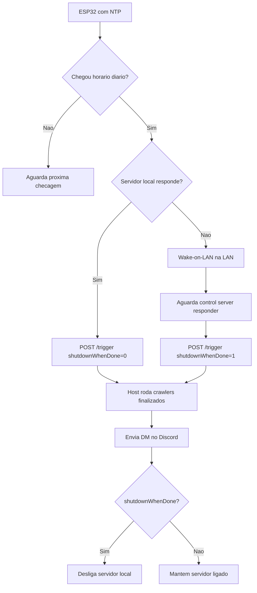

# Plano: crons dos crawlers, WOL e notificacoes

## Objetivo

Criar uma rotina diaria para crawlers incrementais ja finalizados, sem
interferir em crawlers novos que ainda podem rodar por dias.

A rotina deve:

- rodar uma vez por dia, em torno de 05:00 no horario de Brasilia;
- permitir horario configuravel para testes;
- separar crawlers finalizados de crawlers novos/longos;
- publicar um resumo por fonte, preferencialmente no Discord;
- se o servidor local ja estava ligado, manter ligado ao final;
- se o servidor local foi ligado pela propria rotina, desligar ao final.

## Decisao atual

Nao vamos usar o VPS no fluxo principal.

O ESP32 sera o agendador 24/7. Ele fica ligado, sincroniza horario por NTP,
acorda o servidor local por Wake-on-LAN quando necessario e chama um pequeno
control server HTTP no proprio servidor local.

O VPS fica como opcao futura para disparo remoto fora de casa.

## Fontes

### Grupo A - crawlers finalizados

Este grupo e proprio para cron diario/incremental. A expectativa e terminar em
minutos ou poucas horas.

Fontes atuais:

- `central-novel`
- `novel-mania`
- `house-saikai`
- `sky-demon-order`

### Grupo B - crawlers novos/longos

Este grupo nao deve entrar no cron diario. Ele deve ser iniciado manualmente ou
por uma rotina separada, porque pode ficar dias rodando no primeiro crawl.

Regras:

- nunca compartilhar o mesmo lock do cron diario;
- nao bloquear o cron diario dos crawlers finalizados;
- pode ter uma janela propria de execucao e relatorio separado;
- deve continuar usando o monitor/heartbeat para detectar travamentos.

## Arquitetura proposta



### Papel do ESP32

O ESP32 vira o agendador confiavel.

Responsabilidades:

- ficar ligado 24/7;
- sincronizar horario via NTP;
- verificar diariamente se chegou o horario configurado;
- testar `http://192.168.0.42:8020/health`;
- enviar Wake-on-LAN para `0a:e0:af:a7:01:d1` se o servidor estiver desligado;
- aguardar o servidor responder;
- chamar `POST http://192.168.0.42:8020/trigger?shutdownWhenDone=0|1`;
- nao receber conexoes externas, entao seu IP pode continuar via DHCP.

### Papel do servidor local

O servidor local continua sendo o executor real.

Responsabilidades:

- manter um control server local fora do Docker em `:8020`;
- executar `docker compose run --rm crawler oghma crawl --source ...`;
- manter locks;
- coletar contagens antes/depois no Postgres;
- gerar logs locais;
- publicar no B2 depois que os crawlers terminarem;
- enviar notificacao direta ao usuario no Discord;
- desligar somente quando recebeu a flag de shutdown.

### Papel do VPS

Opcional/futuro. Como o VPS nao acessa o ESP32 diretamente, ele nao entra no
primeiro desenho. Se quisermos disparo remoto depois, podemos adicionar VPN,
Tailscale, tunnel ou um mecanismo de fila externa consultado pelo ESP32.

## Fluxo diario

### Cenario 1 - servidor local ja ligado

1. ESP32 chega no horario diario.
2. ESP32 testa `http://192.168.0.42:8020/health`.
3. Se responder, chama:

```text
POST http://192.168.0.42:8020/trigger?shutdownWhenDone=0
```

4. Servidor local roda os crawlers finalizados.
5. Ao final, envia resumo por DM no Discord.
6. Servidor permanece ligado.

### Cenario 2 - servidor local desligado

1. ESP32 chega no horario diario.
2. ESP32 nao consegue acessar `http://192.168.0.42:8020/health`.
3. ESP32 envia Wake-on-LAN.
4. ESP32 aguarda o control server responder.
5. ESP32 chama:

```text
POST http://192.168.0.42:8020/trigger?shutdownWhenDone=1
```

6. Servidor local roda os crawlers finalizados.
7. Ao final, envia resumo por DM no Discord.
8. Mesmo se uma fonte falhar, a rotina termina o grupo e desliga o servidor.

## Scripts a criar

### 1. `backend/deploy/crawl-daily-completed.sh`

Roda no servidor local.

Funcoes:

- lock global: `/srv/oghma/locks/crawl-daily-completed.lock`;
- lock por fonte: `/srv/oghma/locks/crawl-<source>.lock`;
- lista configuravel por env:

```bash
OGHMA_DAILY_SOURCES="central-novel novel-mania house-saikai sky-demon-order"
```

- modo teste:

```bash
OGHMA_CRAWL_LIMIT=3
OGHMA_CHAPTER_LIMIT=5
```

- coleta antes/depois:

```sql
select source_id, count(*) from novel group by source_id;
select n.source_id, count(*) from chapter c join novel n on n.id = c.novel_id group by n.source_id;
```

- executa os crawlers com paralelismo controlado por
  `OGHMA_DAILY_CRAWL_PARALLELISM`;
- grava log geral:

```text
/srv/oghma/logs/crawl-daily-completed-YYYY-MM-DD.log
```

- grava logs por fonte:

```text
/srv/oghma/logs/crawl-central-novel.log
/srv/oghma/logs/crawl-novel-mania.log
...
```

- gera resumo final em JSON e texto;
- publica no B2 por fonte, usando `python -m oghma.publish --source <source>`;
- chama script de notificacao;
- se recebeu `--shutdown-when-done`, chama `sudo shutdown -h now` ao final.

Recomendacao atual: `OGHMA_DAILY_CRAWL_PARALLELISM=4` para os quatro crawlers
finalizados. O publish continua sequencial porque atualiza `publish_state.json`
e `index.json`.

### 2. `backend/deploy/discord-dm.py`

Roda no servidor local.

Entradas:

- titulo;
- status geral;
- inicio/fim/duracao;
- fonte;
- novels antes/depois/delta;
- capitulos antes/depois/delta;
- erros por fonte;
- caminho do log.

O token do bot nao deve ficar hardcoded no repo. Usar env:

```bash
DISCORD_BOT_TOKEN=...
DISCORD_USER_ID=...
```

Observacao importante: o token informado na conversa deve ser rotacionado no
portal do Discord antes de usarmos em producao, porque ja foi exposto em texto
puro.

Para enviar mensagem direta, o bot precisa do `DISCORD_USER_ID`. O id do
aplicativo e a chave publica nao bastam para abrir DM.

### 3. `backend/deploy/oghma-control-server.py`

Roda no servidor local, fora do Docker.

Funcoes:

- expor:

```text
GET  /health
GET  /status
POST /trigger?shutdownWhenDone=0|1
```

- proteger `/status` e `/trigger` com `OGHMA_CONTROL_TOKEN`;
- impedir duas execucoes simultaneas;
- executar o script diario em background.

### 4. `backend/deploy/esp32-oghma-wol/esp32-oghma-wol.ino`

Sketch do ESP32.

Configuracoes principais:

- Wi-Fi;
- token do control server;
- horario diario;
- MAC do servidor;
- broadcast LAN.

## Relatorio esperado no Discord

Exemplo:

```text
Oghma daily crawl finalizado
Duracao: 1h 12m
Servidor: acordado pela rotina, desligando agora

Central Novel: +2 novels, +38 capitulos, 0 erros
Novel Mania: +0 novels, +12 capitulos, 1 erro
House Saikai: +1 novel, +6 capitulos, 0 erros
Sky Demon Order: +0 novels, +24 capitulos, 0 erros

Log: /srv/oghma/logs/crawl-daily-completed-2026-06-21.log
```

Se uma fonte falhar, a rotina continua para as proximas fontes, marca status
final como `partial_failure` e ainda assim desliga o servidor se
`shutdownWhenDone=1`.

O publish tambem entra no resumo. Se uma publicacao falhar, a rotina marca
`partial_failure`, envia a DM e ainda desliga quando `shutdownWhenDone=1`.

## Locks e nao interferencia

Precisamos de tres niveis:

1. lock global do grupo diario;
2. lock por fonte;
3. lock separado para grupo de crawlers novos.

Assim:

- dois crons diarios nao rodam ao mesmo tempo;
- um crawler novo de uma fonte especifica nao disputa com o incremental da mesma
  fonte;
- crawlers longos de fontes novas nao bloqueiam os quatro crawlers finalizados.

Para o primeiro corte, eu evitaria rodar a mesma fonte em dois lugares. Se o
daily detectar lock da fonte, ele pula aquela fonte e notifica `skipped`.

## Estado e metricas

O resumo por fonte deve combinar:

- contagens antes/depois no banco;
- `crawl_run.stats` do run criado;
- exit code do container;
- ultimas linhas do log em caso de erro.

Campos minimos para cada fonte:

- `source`;
- `started_at`;
- `finished_at`;
- `duration_seconds`;
- `novels_before`;
- `novels_after`;
- `novels_added`;
- `chapters_before`;
- `chapters_after`;
- `chapters_added`;
- `exit_code`;
- `status`.

## Seguranca

- Nao commitar token do Discord nem token do control server.
- Criar `.env` no servidor local.
- Usar permissao `600` nos arquivos de env.
- Rotacionar o token do Discord que foi compartilhado em texto.

## Pendencias antes do teste real

1. Gravar o sketch no ESP32 com Wi-Fi e token reais.
2. Criar `/srv/oghma/.env.daily-crawl` no servidor com:
   - `OGHMA_CONTROL_TOKEN`;
   - `DISCORD_BOT_TOKEN`;
   - `DISCORD_USER_ID`.
3. Instalar o service do control server.
4. Rotacionar o token do Discord antes de producao.

## Minha recomendacao de execucao

Fase 1:

- instalar scripts no servidor local;
- rodar manualmente com `OGHMA_CRAWL_LIMIT=1`;
- validar resumo em arquivo, sem shutdown.

Fase 2:

- configurar Discord DM via env;
- testar falha proposital de uma fonte;
- validar mensagem.

Fase 3:

- instalar control server como `systemd`;
- testar `POST /trigger?shutdownWhenDone=0`.

Fase 4:

- gravar ESP32;
- testar horario temporario com servidor ja ligado;
- testar servidor desligado com WOL e `shutdownWhenDone=1`.

Fase 5:

- voltar horario definitivo para 05:00 America/Sao_Paulo.
